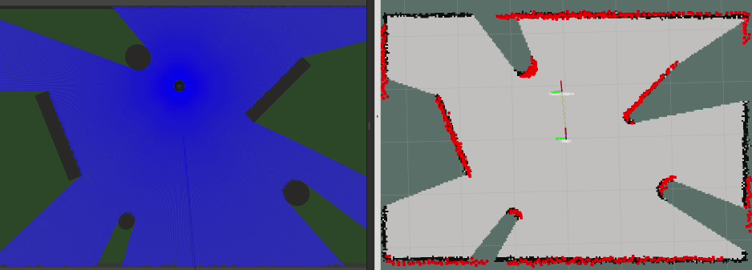

# ROS-four_ws_robot-src

<p align="center">

</p>

## установка пакетов

```bash
cd
mkdir ~/four_ws_robot
cd ~/four_ws_robot
git clone https://github.com/5met4nka/ROS-four_ws_robot-src.git
mv ROS-four_ws_robot-src src
cd src
mkdir -p ~/.gazebo/models
cp -r four_ws_stage ~/.gazebo/models/four_ws_stage
rm -r four_ws_stage
cd ..
catkin_make
cd
```

в случае использование терминальной оболочки `zsh`

```bash
echo "source ~/four_ws_robot/devel/setup.zsh" >> ~/.zshrc
```

или в случае терминальной оболочки `bash`

```bash
echo "source ~/four_ws_robot/devel/setup.bash" >> ~/.bashrc
```

* замечание: ROS может видеть только один ws, поэтому комментим настройку запуска других ws при помощи символа "#"

## запуск навигации

```bash
roslaunch robot_launch launch_simulation_for_navigation.launch
```

```bash
roslaunch navigation_params navigation.launch
```

<p align="center">

</p>

## запуск локализации

```bash
roslaunch robot_launch launch_simulation_for_localization.launch
```

```bash
roslaunch navigation_params localization.launch
```

<p align="center">

</p>

## запуск gmapping

```bash
roslaunch robot_launch launch_simulation_for_map_creation.launch
```

```bash
roslaunch gmapping rviz_slam_gmapping_view.launch
```

<p align="center">

</p>

* сохранение карты в файл

```bash
cd ~/four_ws_navigation/src/navigation_params/map
```

```bash
rosrun map_server map_saver -f four_ws_map
```

# [описание параметров slam_gmapping](documentation/slam_gmapping_params.md)

> ## [настройка slam_gmapping в этом проекте](slam_gmapping_params/gmapping/config/gmapping_params_test.yaml)

# [описание параметров amcl](documentation/amcl_params.md)

> ## [настройка amcl в этом проекте](navigation_params/config/amcl/amcl_params_test.yaml)

# [описание параметров movebase](documentation/movebase_params.md)

> ## [настройка movebase в этом проекте](navigation_params/config/movebase/movebase_params_test.yaml)
