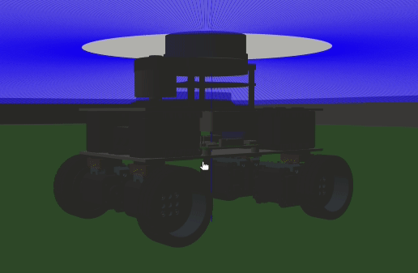
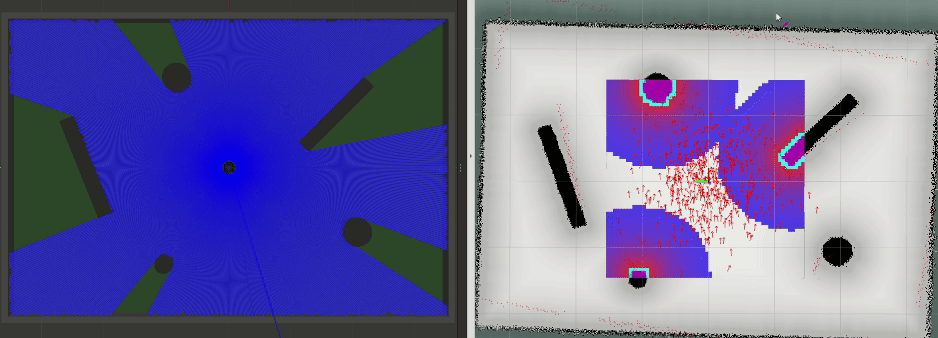
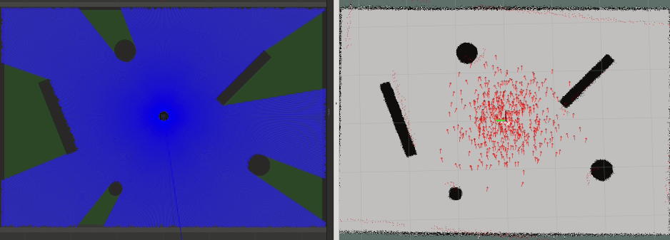
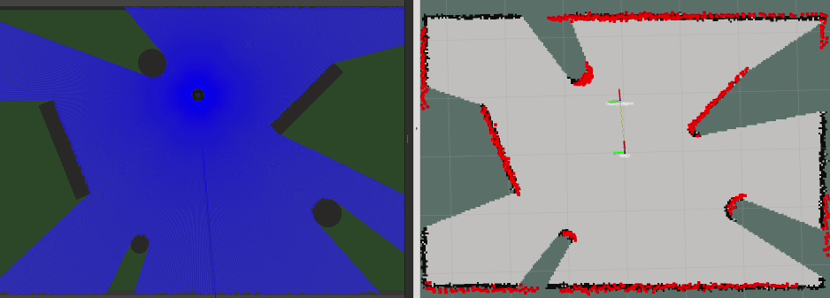

# ROS-four_ws_robot-src

<p align="center">

</p>

> ### инструкция по началу работы находится [здесь](docs/DEVELOPMENT.md)

## запуск

```bash
roslaunch four_ws_robot_software sim_start.launch
```

<p align="center">

</p>

<p align="center">

</p>

<p align="center">

</p>

* сохранение карты в файл

```bash
roslaunch four_ws_robot_software map_saver.launch
```

* сборка изображения Docker

```bash
docker image build -t lsd-maddrive-ros:noetic-desktop-full .
```

* запуск контейнера в хост-системе Linux

```bash
docker container run -it \
    --name=four_ws_robot \
    --user=user1122 \
    --network=host \
    --ipc=host \
    --volume=$HOME/catkin_ws/src/four_ws_robot:/home/user1122/catkin_ws/src/four_ws_robot \
    --volume=$HOME/catkin_ws/src/maddrive_ros_shared:/home/user1122/catkin_ws/src/maddrive_ros_shared \
    --volume=/tmp/.X11-unix:/tmp/.X11-unix:rw \
    --env=DISPLAY \
    --device=/dev/ydlidar \
    --device=/dev/input/js0 \
    lsd-maddrive-ros:noetic-desktop-full
```

* запуск контейнера в хост-системе Windows

```bash
docker container run -it `
    --name=four_ws_robot `
    --user=user1122 `
    --network=host `
    --ipc=host `
    --volume=C:\Users\Nikita\Documents\catkin_ws\src\four_ws_robot:/home/user1122/catkin_ws/src/four_ws_robot `
    --volume=C:\Users\Nikita\Documents\catkin_ws\src\maddrive_ros_shared:/home/user1122/catkin_ws/src/maddrive_ros_shared `
    -e DISPLAY=host.docker.internal:0.0 `
    lsd-maddrive-ros:noetic-desktop-full
```

* расширяем ws в контейнере

```bash
sudo catkin config --extend /opt/ros/noetic
```

```bash
sudo ./src/four_ws_robot/scripts/build.sh
```

* проверяем, работает ли GUI

```bash
roslaunch turtle_tf turtle_tf_demo.launch
```

* если не работает, выполняем команду в хост-системе

```bash
xhost +
```
